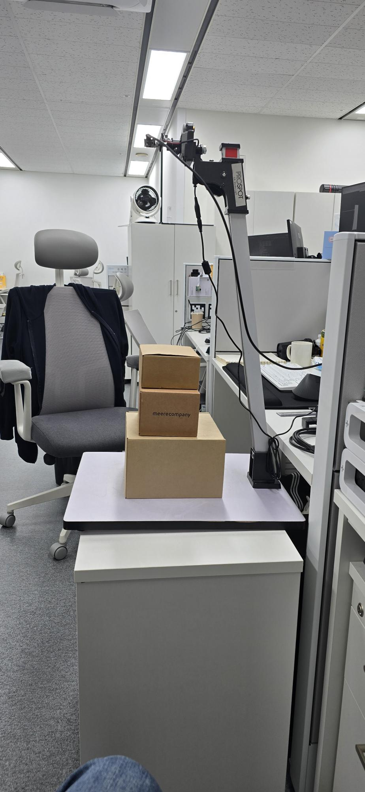
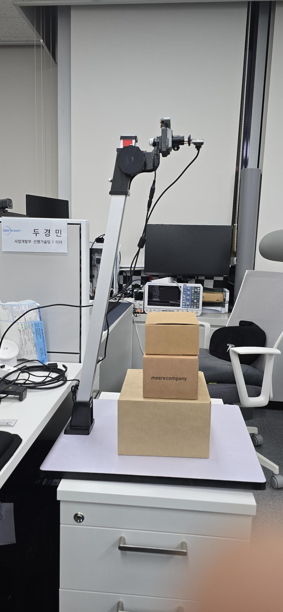

*********************************
VOMASYS-meerecompany User Manual
*********************************

.. contents:: Table of Contents

---------

개발 환경
========

:doc:`OS`
    ``Windows 11``
    
:doc:`IDE`
    ``Qt 5.15.2``
    
:doc:`Compiler`
    ``MSVC2019 ( Visual Studio 2019 )``
    
:doc:`Changelog </dev_env/changelog>`
    개발 환경 변경 사항.

.. toctree::
   :maxdepth: 2
   :hidden:
   :caption: development
    
    /dev_env/development
    /dev_env/changelog

실행 환경
========

:doc:`OS`
    `Windows 11``

:doc:`Install </exec_env/excution>`
    How to configure kernel.
    
:doc:`Changelog </exec_env/changelog>`
    실행 환경 변경 사항.

.. toctree::
   :maxdepth: 2
   :hidden:
   :caption: execution
   
   /exec_env/excution
   /exec_env/changelog

검증 환경
========

.. figure:: static/1.jpeg
    :width: 50%
    :align: center
    :alt: ...

운영 환경
========

:doc:`Feedback </op_env/operation>`
    How to create a rootfs image
    
:doc:`Changelog </op_env/changelog>`
    운영 환경 변경 사항.

.. toctree::
   :maxdepth: 2
   :hidden:
   :caption: operation
   
   /op_env/operation
   /op_env/changelog
