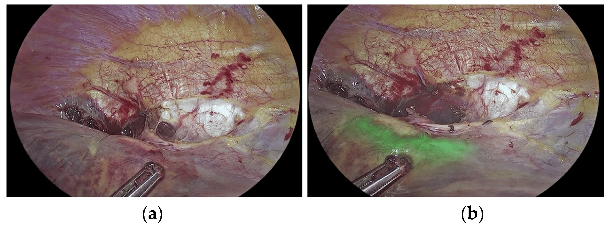

**************************************
Lumino Imager Color User Manual
**************************************

.. toctree::
   :maxdepth: 2
   :hidden:
   :caption: 개요

   /intro_env/about

.. toctree::
   :maxdepth: 2
   :hidden:
   :caption: 지원 사양

   /spec_env/usb
   /spec_env/sdcard
   /spec_env/network

.. toctree::
   :maxdepth: 2
   :hidden:
   :caption: 개발 환경

   /dev_env/impl
   /dev_env/deploy
   /dev_env/test
   /dev_env/repo

.. toctree::    
   :maxdepth: 2
   :hidden:
   :caption: 실행 환경

   /exec_env/sw_stack

.. toctree::
   :maxdepth: 2
   :hidden:
   :caption: 관리 환경

   /mgmt_env/issues
   /mgmt_env/changes
   /mgmt_env/version
   /mgmt_env/status

.. toctree::
   :maxdepth: 2
   :hidden:
   :caption: 운영 환경

   /op_env/deploy

.. toctree::
   :maxdepth: 2
   :hidden:
   :caption: Reference

   /ref_env/changelog

.. contents:: Table of Contents

Welcome to ICG-Color Documentation
==================================

- Indocyanine Green (ICG) and Colorectal Surgery_: A Literature Review on Qualitative and Quantitative Methods of Usage.
- Indocyanine Green Fluorescence in Gastrointestinal Surgery_: Appraisal of current evidence

.. _Indocyanine Green (ICG) and Colorectal Surgery: https://www.mdpi.com/1648-9144/59/9/1530
.. _Indocyanine Green Fluorescence in Gastrointestinal Surgery: https://www.wjgnet.com/1948-9366/full/v15/i12/2693.htm

지원사양
---------------------

:doc:`USB </spec_env/usb>`
    ... .

:doc:`SD Card </spec_env/sdcard>`
    ... .

:doc:`Network </spec_env/network>`
    ... .

동작환경
---------------------

:doc:`시스템 구동 </exec_env/exec_hw_method>`
    ... .

:doc:`프로그램 실행 </exec_env/exec_sw_method>`
    ... .

개발환경
---------------------

:doc:`구현 </dev_env/impl>`
    ... .

:doc:`배포 </dev_env/deploy>`
    ... .

:doc:`테스트 </dev_env/test>`
    ... .

:doc:`검증 </dev_env/test>`
    ... .

:doc:`형상관리 </dev_env/repo>`
    ... .

실행환경
---------------------

:doc:`소프트웨어 스택 </exec_env/sw_stack>`
    ... .

관리환경
---------------------

:doc:`변경관리 </mgmt_env/changes>`
    ... .

:doc:`현황관리 </mgmt_env/status>`
    ... .

운영환경
---------------------

:doc:`배포 </op_env/deploy>`
    ... .